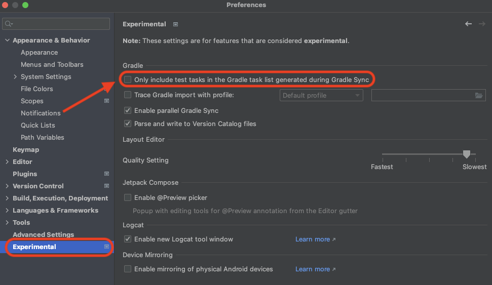

# <<ReplaceAppName>>

## Features 📋

## Built With 🛠

- [Kotlin](https://kotlinlang.org/) - First class and official programming language for Android
  development.
- [Jetpack Compose](https://developer.android.com/jetpack/compose) - Jetpack Compose is Android’s
  modern toolkit for building native UI.
- [Coroutines](https://kotlinlang.org/docs/reference/coroutines-overview.html) - A coroutine is a
  concurrency design pattern that you can use on Android to simplify code that executes
  asynchronously.
- [Flow](https://kotlinlang.org/docs/reference/coroutines/flow.html) - A flow is an asynchronous
  version of a Sequence, a type of collection whose values are lazily produced.
- [Android Architecture Components](https://developer.android.com/topic/libraries/architecture) -
  Collection of libraries that help you design robust, testable, and maintainable apps.
  - [ViewModel](https://developer.android.com/topic/libraries/architecture/viewmodel) - Stores
    UI-related data that isn"t destroyed on UI changes.
  - [Lifecycle](https://developer.android.com/topic/libraries/architecture/lifecycle) - Lifecycle
    aware components perform actions in response to a change in the lifecycle status of another
    component, such as activities and fragments.
  - [Stateflow](https://developer.android.com/kotlin/flow/stateflow-and-sharedflow) - StateFlow is a
    state-holder observable flow that emits the current and new state updates to its collectors.
  - [Flow](https://kotlinlang.org/docs/reference/coroutines/flow.html) - A flow is an asynchronous
    version of a Sequence, a type of collection whose values are lazily produced.
  - [Jetpack Compose Navigation](https://developer.android.com/jetpack/compose/navigation) - The
    Navigation component provides support for Jetpack Compose applications.
- [Material Components for Android](https://github.com/material-components/material-components-android)
  - Modular and customizable Material Design UI components for Android.
- [Accompanist](https://github.com/material-components/material-components-android) - Accompanist is a
  group of libraries that aim to supplement Jetpack Compose with features that are commonly required
  by developers but not yet available.
- [Hilt](https://developer.android.com/training/dependency-injection/hilt-android) - Hilt is a
  dependency injection library for Android that reduces the boilerplate of doing manual dependency
  injection in your project.
- [Retrofit](https://square.github.io/retrofit/) - A type-safe HTTP client for Android.
  Retrofit turns your HTTP API into a Java interface, Annotations on the interface methods and
  its parameters indicate how a request will be handled.


## Screenshots 📷

<p align="center">


</p>

## Project structure 🔎

## Architecture 🗼

I use MVVM adapted to Compose with Repository pattern and Clean Architecture general principles and
[SOLID principles](http://en.wikipedia.org/wiki/SOLID_%28object-oriented_design%29) can be
applied to Android development.

SOLID Components are an attempt at following good engineering standards and best practices such
as [SOLID](https://en.wikipedia.org/wiki/SOLID)
and [DRY](https://en.wikipedia.org/wiki/Don%27t_repeat_yourself) where Google neglected to.

## Presentation patterns layers 🔌️
* View - Composable screens that consume state, apply effects and delegate events upstream.
* ViewModel - [AAC ViewModel](https://developer.android.com/topic/libraries/architecture/viewmodel)
  that manages and set the state of the corresponding screen. Additionally, it intercepts UI events
  as callbacks and produces side-effects. The ViewModel is scoped to the lifetime of the corresponding
  screen composable in the backstack.
* Model - Data source classes that retrieve content. In a Clean architecture context, one could use
  UseCases or Interactors that tap into repositories or data sources directly.


As the presentation layer is defined with MVVM, there are a two core components described:
* **State** - data class that holds the state content of the corresponding screen e.g. list of `Tenant`,
  loading status etc. The state is exposed as a Compose runtime `MutableState` object from that perfectly
  matches the use-case of receiving continuous updates with initial value.

* **Effect** - plain object that signals one-time side-effect actions that should impact the UI e.g.
  triggering a navigation action, showing a Toast, SnackBar etc. Effects are exposed as `SharedFlow`
  which behave as in each event is delivered to a single subscriber. An attempt to post an event
  without subscribers will suspend as soon as the channel buffer becomes full, waiting for a
  subscriber to appear.

Every screen/flow defines its own contract class that states all corresponding core components
described above: state content and effects.

### **UiState📘**
UiState represents the composition between data class and sealed interfaces.<br />
**Data class** contains all UI-elements states that can be updated.<br />
**Sealed interface** represents I/O(network, database, etc.) interactions that affect UI updates.
E.g.
```
data class LoginUiState(
    val userState: UserUiState = UserUiState.Success(User.emptyUser()),
    val loading: Boolean = false,
    val userName: String = "user@dualb.it",
    val password: String = "XXXXXXXX"
)

sealed interface UserUiState {
    data class Success(val user: User = User.emptyUser()) : UserUiState
    data class Error(val message: String) : UserUiState
}
```
* **Using val**
  All data class property must be immutable, so it cannot be changed without creating a new object.
  E.g
  ```
  data class Tenant(val name: String, val default: Int)
  ```
* [Using copy](https://medium.com/geekculture/atomic-updates-with-mutablestateflow-dc0331724405)
  Data classes have a convenient `copy` function that allows you to update one or more properties of
  the data class while preserving the remaining values.
  E.g
  ```
  tenant = tenant.copy(name = "Re4work")
  ```
* [StateFlow.update{}](https://medium.com/geekculture/atomic-updates-with-mutablestateflow-dc0331724405)
  Using one of the MutableStateFlow update extension functions can mitigate concurrency issues without the
  use of verbose and potentially thread blocking mutexs.
  E.g
  ```
  viewModelScope.launch(Dispatchers.Default) {
    _viewState.update { it.copy(title = "New title") }
  }
  ```
  In this way the copy function of the data class ends up with fresh data and can then safely set
  the StateFlow value while still preserving the unmodified properties.

### **Best Practices📘**
* [Using References](https://skyyo.medium.com/performance-in-jetpack-compose-9a85ce02f8f9)
  Using references inside lambdas it will prevent the creation of a new class that references the outside variable.
  E.g
  ```
  Column {
        // button is not skippable in the recomposition due to usage of viewModel.onContinueClick()
        // Button considered "unstable"
        Button(onClick = { viewModel.onContinueClick() }) {
            Text(text = "button with unstable lambda")
        }
    }
  ```
  ```
  Column {
        // button is skipped in the recomposition because it uses a reference to onContinueClick()
        // Button considered "stable"
        Button(onClick = viewModel::onContinueClick) {
            Text(text = "button with stable lambda")
        }
    }
  ```
* [Using Remembered lambdas](https://skyyo.medium.com/performance-in-jetpack-compose-9a85ce02f8f9)
  Explicitly remembering lambdas will ensure that we reuse the same lambda instance across recompositions.
  E.g
 ```
  @Composable
  fun MyComposableScreen(viewModel: MyViewModel = hiltViewModel()) {
      val focusRequester = LocalFocusManager.current
      val onClick: (value: String) -> Unit = remember {
          return@remember viewModel::onClick
      }
      val clearFocus = remember { { focusRequester.clearFocus() } }

      Column {
          // stable lambdas, skippable button
          Button(onClick = {
              onClick("..")
              clearFocus()
          }) {
              Text(text = "button with stable lambdas")
          }
      }
  }
```
* [Passing primitive types to composables](https://skyyo.medium.com/performance-in-jetpack-compose-9a85ce02f8f9)
  All primitive types (String, Int, Float, etc) are considered immutable. Pass stable fields directly to the composable which needs them: for instance instead of passing user class you pass it’s primitives: user.id, user.name. E.g.
``` 
  // not skippable if User is unstable
  @Composable
  private fun UserDetails(user: User) {
      Text(text = "name: ${user.name} id:${user.id}")
  }

  // skippable even of User is unstable
  @Composable
  private fun UserDetails(id: Long, name: String) {
      Text(text = "name: $name id: $id")
  }
```
* [Inlined composables](https://skyyo.medium.com/performance-in-jetpack-compose-9a85ce02f8f9)
  It’s important to be aware that Column, Row & Box are inlined, meaning that they don’t produce their own state read scope, only use their parent scope. When state is read, it triggers recomposition in the nearest scope. This fact might be an issue when using inlined composables:
``` 
//by clicking the button StateReadsInlinedComposablesScreen is recomposed at each click
@Composable
fun StateReadsInlinedComposablesScreen() {
    var count by remember { mutableStateOf(0) }

    Column {
        Text(text = "count: $count")
        Button(onClick = { count++ }) {
            Text(text = "count++")
        }
    }
}
```
We can see that StateReadsInlinedComposablesScreen is being recomposed when we press the button, since it’s considered to be the nearest recomposition scope. This can be fixed by the following:
``` 
//by wrapping the Column we avoid the recomposition of the entire screen
@Composable
fun StateReadsInlinedComposablesScreen() {
    var count by remember { mutableStateOf(0) }

    WrappedColumn {
        Text(text = "count: $count")
        Button(onClick = { count++ }) {
            Text(text = "increase count")
        }
    }
}

//WrappedColumn is now considered the nearest scope to the Column
@Composable
fun WrappedColumn(content: @Composable ColumnScope.() -> Unit) {
    Column(content = content)
}
```
* [Using lambda modifiers](https://skyyo.medium.com/performance-in-jetpack-compose-9a85ce02f8f9)
  When you are passing frequently changing state variables into modifiers, you should use the lambda versions of the modifiers whenever possible. E.g.
  ```
  @Composable
  private fun HorizontallyMovingButton(scrollOffset: Float) {
      Button(modifier = Modifier.graphicsLayer(translationX = scrollOffset))
  }
  
  //using the lambda version of graphicsLayer is more performant
  //using lambda to provide scrollOffset is more performant
  @Composable
  private fun HorizontallyMovingButton(scrollProvider: () -> Float) {
      Button(modifier = Modifier.graphicsLayer { translationX = scrollProvider() }) 
  }
  
  ```
